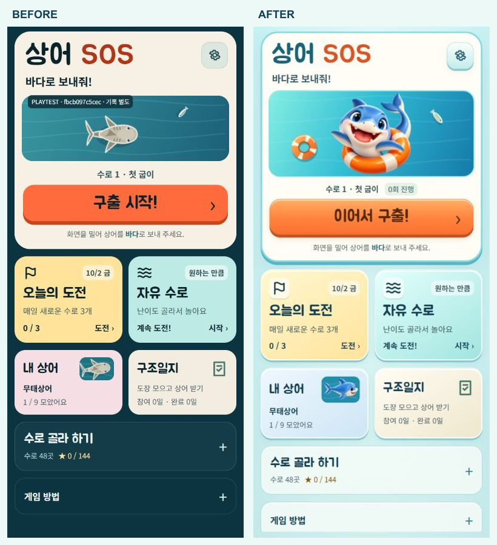
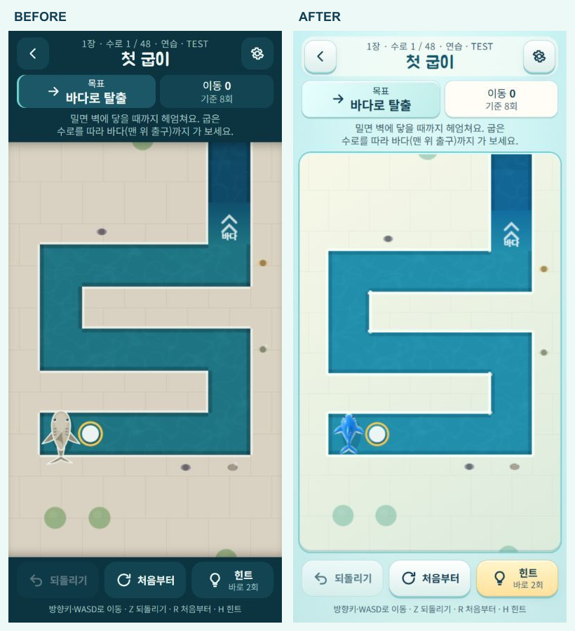
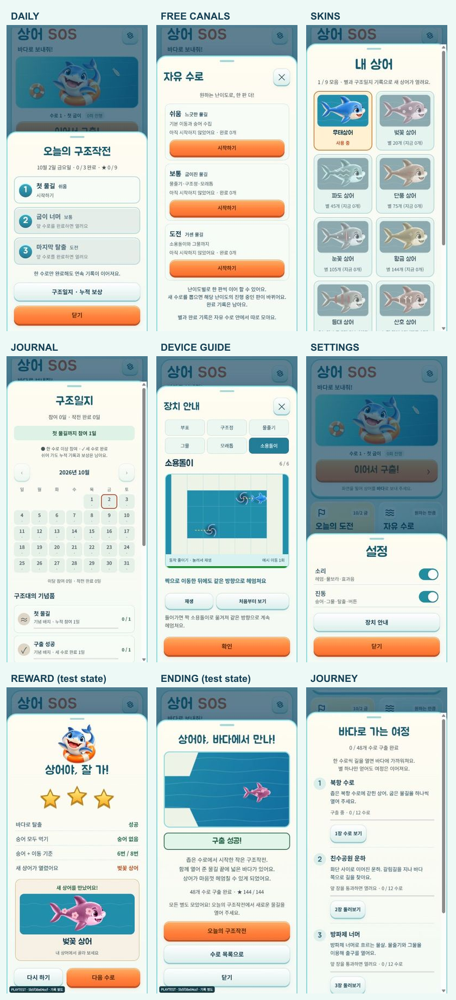

# 신규 아이콘 기반 전체 비주얼 리디자인

2026-10-02. 기준은 `assets/icon-concepts/shark-sos-3d-v1-original.png`다. 기존 Canvas·CSS·SVG 구조에 투명 캐릭터 이미지를 더했다. 규칙·48개 수로·별 기준·외형 획득 조건·저장 키·힌트 정책은 유지한다.

## 진단과 적용

기존 메인의 플레이 진입 순서와 한글 제목은 유지할 장점이었다. 어두운 항구 배경, 회색 상어와 평면적인 외형 미리보기는 밝은 신규 아이콘과 달랐다. 기존 모드·접는 목록·장치 예시·보상 연출을 재사용하면서 표현을 교체했다.

| 화면·요소 | 변경 내용 | 유지한 동작 |
|---|---|---|
| 메인 | 웃는 상어와 구명튜브, 아쿠아 배경, 얇은 베벨, 주황 구출 버튼 | 구출 → 오늘의 도전·자유 수로 → 내 상어·일지 → 수로 목록. 배경 이야기 문단 없음 |
| 게임판 | 밝은 산책로, 둥근 프레임, 청록 물길, 하늘색 상어, 밝은 HUD | 격자·이동 판정·목표·이동 횟수 |
| 구명튜브 | 중앙이 뚫린 주황 링, 네 아이보리 띠, 접촉 그림자 | 기존 부표의 충돌 칸 |
| 구조정·숭어·그물 | 곡면 음영, 크림빛 수집 대상, 또렷한 그물 테두리 | 방향·턴 이동·수집·설치/회수 |
| 물줄기·모래톱·소용돌이·출구 | 어두운 방향 패널, 모래색 정지 칸, 보랏빛 소용돌이, 밝은 출구 | 화살표·짝 이동·정지 규칙 |
| 오늘의 도전·자유 수로 | 밝은 패널, 입체 단계 번호, 잠김/완료 구분 | 세 단계 해금·난이도별 생성·진행 |
| 내 상어 | 공통 캐릭터의 측면 미리보기, 기존 9개 외형의 색·무늬·장식 | 소유권·조건·선택 저장 |
| 일지·여정·수로 선택 | 아이보리/민트 패널, 상태색, 짙은 본문 | 도장·배지·누적 기록·챕터 해금 |
| 설정·장치 안내 | 공통 패널, 새 상어·장치를 사용하는 기존 반복 예시 | 포커스·재생/정지·닫기·봤던 장치 기록 |
| 클리어·외형 보상 | 웃는 상어, 음영이 있는 금색 별, 큰 외형 미리보기 | 별 판정·보상 시점·다음 수로. 긴 보상은 본문만 스크롤 |
| 엔딩 | 같은 위쪽 시점 상어가 밝은 물길에서 바다로 이동 | 48개 탈출 조건·외형·다시 보기 |

메인·게임·일일·외형·일지는 변경 전 브라우저 캡처를 남겼다. 나머지는 기존 마크업/렌더링 경로와 변경 후 실제 화면을 함께 확인했다.

## 공통 기준

스타일은 `src/art-theme.css`, 이미지 로딩·외형별 캐시는 `src/art.js`에 모았다. 기존 토큰을 덮어써 Canvas와 DOM이 같은 색을 사용한다.

| 역할 | 기준 |
|---|---|
| 배경 / 패널 | `#DCF5F4` / `#FFFDF5` |
| 물길 / 바다 | `#218EAC` / `#126D9E` |
| 본문 / 보조 글자 | `#153F53` / `#426574` |
| 행동·구명튜브 / 깊은 주황 | `#FF873F` / `#C65121` |
| 기본 상어 / 금색 별 | `#69B5EC` / `#FFC64A` |
| 선택 / 잠김 | 크림 바탕·주황 테두리 / 회녹색 바탕·잠김 문구 |
| 곡률·베벨 | 대표 카드 28px, 게임판 18px, 프레임 2–3px. 밝은 윗면과 아래쪽의 짧은 그림자 |
| 글자 | 기존 주아·Noto Sans KR 유지. 제목 38–44px, 부제 14–16px, 모드 24px. 작은 본문에 입체 그림자 없음 |
| 조작 | 주요 버튼 최소 44px, 공통 눌림·포커스. 결과 다음 버튼 고정, 본문 스크롤 |

메인 아트는 보통 144px, 높이 700px 이하에서는 116px다. 구출 버튼은 보통 56px, 작은 화면 50px 기준이다. 320px 너비에서는 내 상어 미리보기 폭을 줄였다. 게임판 테두리는 가상 요소에 그려 Canvas 원점·터치 좌표를 밀지 않는다.

## 자산과 제작 기록

기준 아이콘을 참조한 ImageGen 제작물이다. 투명 PNG 원본은 `assets/art/source/`, 정확한 프롬프트는 [PROMPTS.txt](../assets/art/PROMPTS.txt)에 보관한다.

| 파일 | 크기·용량 | 사용 위치 |
|---|---|---|
| `shark-hero.webp` | 512×512 · 47,938 B | 메인, 클리어 |
| `shark-portrait.webp` | 384×384 · 21,238 B | 내 상어 카드, 외형 선택, 새 외형 보상 |
| `shark-swim.webp` | 256×256 · 13,084 B | 플레이, 장치 예시, 엔딩 |

`assets/art/` 내 사용 파일 합계 82,260 B(약 80.3 KiB). 플레이는 머리 오른쪽·꼬리 왼쪽의 위쪽 시점 자산을 회전한다. 정면 얼굴을 게임판에 붙이지 않았다. 외형은 색을 입힌 비트맵을 최초 사용 시 캐시하고 기존 장식을 덧그린다.

- 내보내기: `node tools/prepare-art.js <기존 sharp 모듈 경로>`
- `tools/build-source.js`가 WebP를 data URL로 내장한다. 웹·단일 HTML·아티팩트·Capacitor가 같은 아트를 사용하며 별도 이미지 서버에 의존하지 않는다.
- 로딩 전/실패 시 기존 Canvas 상어를 새 색으로 그린다. 결과 장식 이미지 실패 시 해당 장식만 숨긴다.
- 신규 런타임 라이브러리나 외부 에셋을 추가하지 않았다.

## 애니메이션과 비용

기존 단일 프레임 루프, 이동 60fps/대기 30fps 상한, 화면 중단, 동작 줄이기를 재사용했다. 새 반복 타이머는 없다. 꼬리 부분만 작게 흔들고 기존 이동 늘어남·정지 탄성·숭어 반응을 유지한다. 메인은 작은 상하 움직임과 물결 반응, 클리어는 0.6초의 짧은 등장 연출을 사용한다.

정적 배경은 기존 오프스크린 Canvas를 유지하고 색 변환을 매 프레임 반복하지 않는다. 동작 줄이기에서는 새 꼬리·메인·클리어 움직임도 정지한다. 이 설계와 자동 검사 결과는 실물 저사양 휴대폰의 FPS·메모리 측정 결과가 아니다.

## 전후 비교

동일한 390×844 브라우저 크기다. TEST 표시는 격리된 개발 검증 빌드 표식이며 세션의 진행 표시는 다를 수 있다.

외형 보상·엔딩은 별도 저장 키를 쓰는 검증 HTML의 합성 상태다. 실제 이용자의 획득 기록이나 48개 전체 플레이 완료 결과가 아니다. 검증 HTML·테스트 버튼은 배포에 포함하지 않는다.

## 검증 결과

- `npm test`: **95/95 통과**. 기존 이동·풀이·힌트·저장·일일 호환·자유 수로·보상·장치·동작 중단 검사와 신규 이미지 실패/캐시/내장 검사.
- `npm run verify`: **48개 전체 통과**. 최소 이동·별 기준·그물 조건 유지. 엔진·수로·일일/자유 생성기는 변경하지 않았다.
- `build`, `build:artifact`, `build:web`, `build:playtest`, `cap:sync` 성공. 웹 단일 HTML 약 428.5 KiB. 플레이테스트 본문 지문 `5b5f38e04ccf`.
- Android `assembleDebug` 성공. 밝은 배경에 맞춰 SystemBars를 LIGHT로 변경했다. 설치된 Capacitor 구현의 light-status/navigation-bar 설정을 확인했다.
- 320×568, 390×844에서 메인·게임·팝업 확인. 메인 가로 넘침 없음. 320px 장치 안내의 탭·재생 버튼은 44px 이상, 닫기 46px. 긴 보상에서도 다음 버튼은 화면 안(아래 548px), 본문만 스크롤(296px 공간에 502px 내용)한다.
- 실제 키 입력: 첫 수로 `R U L U R U`로 6회/별 3개 클리어, 다음 수로와 첫 장치 팝업 확인. 되돌리기 1→0, 재이동·새로고침 후 `1회 진행` 이어하기 확인.
- 실제 Canvas 탭: 수로 10의 빈 물 칸에 그물 설치(남은 수 1→0), 되돌리기(0→1), 힌트의 위쪽 방향·남은 5회 표시 확인.
- 설정 Escape 닫기 후 설정 버튼으로 포커스 복귀. 여섯 장치 탭, 동작 줄이기 정지 예시·직접 재생 확인. 정상 릴리스 빌드의 잠긴 외형·수로 유지 확인.
- 모든 외형 색·선택, 새 외형 보상, 엔딩은 합성 데이터로 검토했다. 이미지 URL을 깨뜨린 격리 빌드에서 대체 상어·실제 이동·깨진 결과 장식 숨김을 확인했다. 정상 이미지 브라우저 검사에서 JavaScript 오류 없음.

로그·원본 캡처·실패 주입·합성 HTML은 로컬 `outputs/qa/redesign/`에만 보관한다. 연결된 Android 기기/에뮬레이터가 없어 실물 WebView·터치 스와이프 감도·저사양 FPS·메모리는 미검증이다. Android 빌드 성공을 실물 기기 검증으로 취급하지 않는다.

다음 검증은 실물 Android의 스와이프·햅틱·백그라운드 복귀·시스템 바·프레임이다. 실제 이용자의 재미/가독성 평가는 `PLAYTEST.md` 절차와 구분한다.
